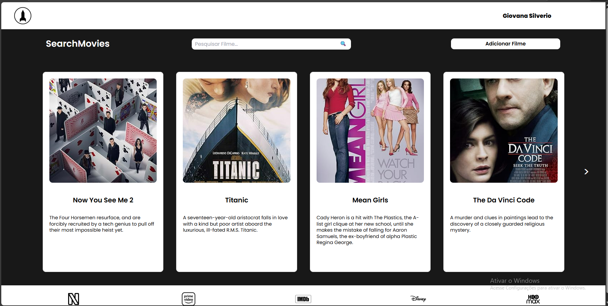
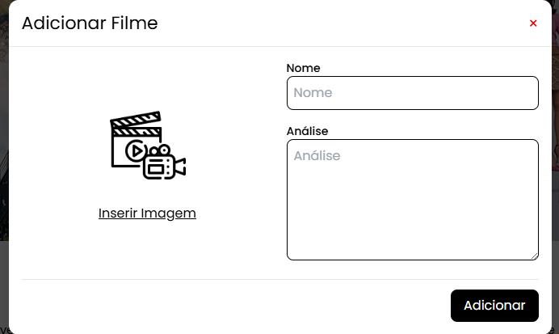
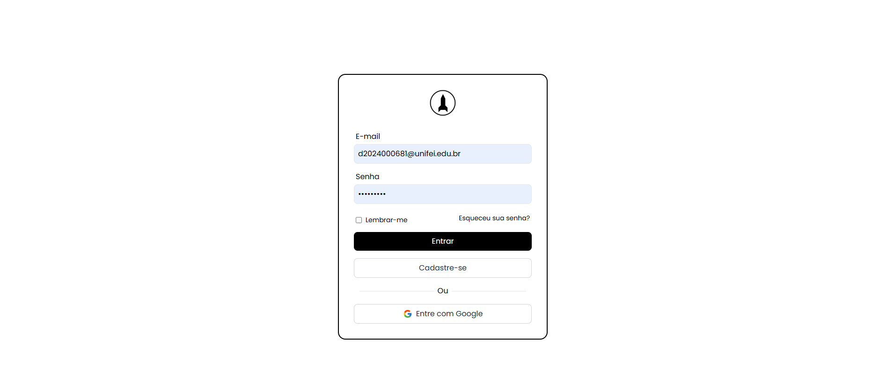

# **Search Movies**  

---

## **Descrição do Projeto**

Este projeto consiste em uma aplicação web desenvolvida para o projeto final da disciplina de Programação Web da Universidade Federal de Itajubá.  
O sistema consome dados da **API OMDb**, realiza a persistência de informações no **Firebase Firestore** e utiliza **Angular** como framework principal do front-end.

O objetivo é oferecer uma plataforma intuitiva para pesquisa de filmes, exibição de cards com detalhes e gerenciamento personalizado pelo usuário autenticado.

### **Principais Funcionalidades**
- Buscar filme automaticamente na OMDb a partir do título  
- Cadastro de filmes com imagem manual ou pôster oficial  
- Edição e exclusão de filmes armazenados no Firestore  
- Autenticação com Firebase Authentication  
- Login com e-mail/senha ou Google  
- Proteção de rotas com Guards  
- Modal dinâmico para edição  
- Interface moderna com TailwindCSS / SCSS


## **Tecnologias Utilizadas**

### **Front-end**
- Angular 18.2
- TypeScript
- HTML / SCSS
- TailwindCSS
- Font Awesome

### **Back-end**
- Node.js + Express  
- API interna para consumir a OMDb com segurança  
- Dotenv para manuseio da chave da API

### **Serviços**
- Firebase Authentication  
- Firebase Firestore  
- Firebase Storage  

### **Ferramentas**
- Git & GitHub  
- Postman (para testes da API)  

## **Screenshots**

### 🔹 Tela Inicial  


### 🔹 Modal de Adicionar Filme  


### 🔹 Página de Login  


### 🔹 Página de Cadastro  


## **Integrantes do Projeto**

| Nome | GitHub |
|------|--------|
| *Giovana Silverio Pereira* | [link](https://github.com/giovanasilverio) |


## **Como Rodar o Projeto**

### Front-end
```bash
cd client
npm install
ng serve

Back-end
cd server
npm install
npm start

Crie o arquivo:

server/.env

Com:

OMDB_API_KEY=SUA_CHAVE_AQUI
